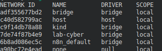
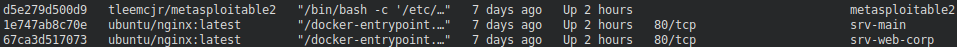
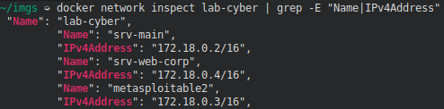
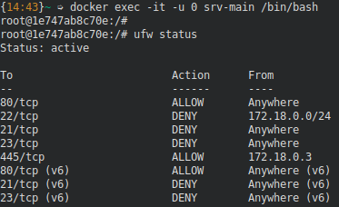

# setup da rede docker

criando a rede docker &#x2013;>

    docker network create --driver bridge lab-cyber

# deploy dos containers

## Metasploitable2

criando o container metasploitable2 &#x2013;>

    docker run -d --name metasploitable2 \
      --network lab-cyber \
      --privileged \
      -it tleemcjr/metasploitable2 /bin/bash -c "/etc/init.d/rc 2 && /bin/bash"

## Servidores web nginx

criando os containers que simulam outros servers &#x2013;>

    docker run -d --name srv-web-corp \                                                             
    --network lab-cyber \
    --privileged \
    ubuntu/nginx:latest

    docker run -d --name srv-main \       
    --network lab-cyber \
    --privileged \
    ubuntu/nginx:latest

# Verificand dos containers

containers rodando &#x2013;>

    docker ps

veriricando a network docker criada &#x2013;>

    docker network inspect lab-cyber | grep -E "Name|IPv4Address"

# Acesso aos containers

acessando um dos servers como root &#x2013;>

    docker exec -it -u 0 srv-main /bin/bash

configurando o ufw para estudos em um dos containers &#x2013;>

    ufw allow 80/tcp
    ufw allow from 172.18.0.0/24 to any port 22 proto tcp
    ufw allow from 172.18.0.3 to any port 445 proto tcp

